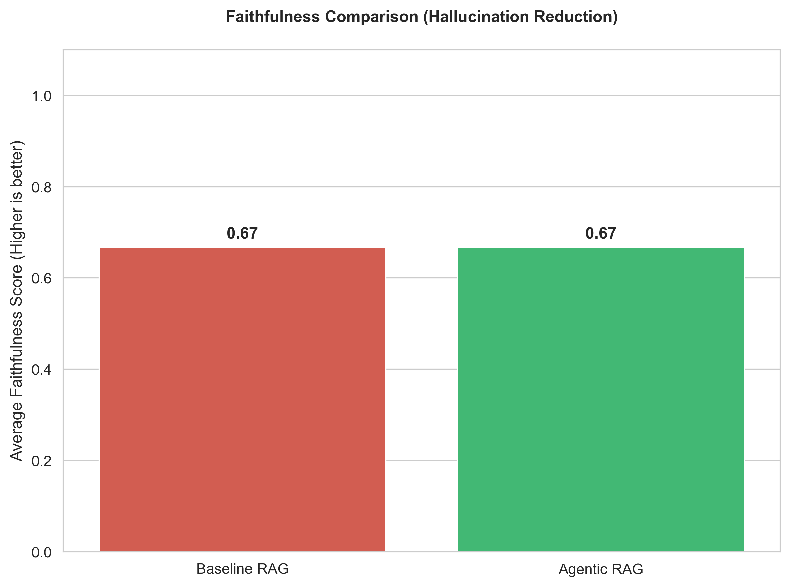

# Critic-Guided Agentic Hybrid RAG

[](https://github.com)
[](https://python.org)
[](https://github.com/langchain-ai/langgraph)
[](LICENSE)
[](https://aclanthology.org)

> **A production-oriented, multi-agent Retrieval-Augmented Generation (RAG) system engineered to significantly reduce LLM hallucinations through critic-guided verification, adaptive retrieval policies, and failure-aware long-term memory.**

---

## Project Summary

Designed and implemented a multi-agent RAG system in Python using **LangGraph** for orchestration, addressing documented limitations of standard RAG pipelines. The system coordinates 7 specialized agents across planning, hybrid retrieval, critic-guided validation, atomic fact-checking, and web fallback. Engineering improvements over the RAG-Critic ACL 2025 baseline include an **Adaptive Retrieval Policy** (reducing unnecessary compute by routing queries to shallow `k=3` vs. deep `k=10` Cross-Encoder pipelines), an **Atomic Claim Verifier** for sentence-level hallucination risk scoring, and a **Semantic Failure Memory** module backed by ChromaDB to prevent recurring retrieval failures. Evaluated across Faithfulness, Hallucination Rate, Retrieval Precision, and Latency benchmarks using an automated evaluation suite.

**Skills demonstrated:** LangGraph, RAG architecture, LLM systems engineering, ChromaDB, BM25, SentenceTransformers, Streamlit, Python, LLM evaluation, agentic system design.

---

## Table of Contents

- [Project Overview](#project-overview)
- [Research Positioning](#research-positioning)
- [Key Contributions](#key-contributions)
- [Architecture](#architecture)
- [Technologies Used](#technologies-used)
- [Repository Structure](#repository-structure)
- [Setup Instructions](#setup-instructions)
- [Running the Application](#running-the-application)
- [Benchmarking & Evaluation](#benchmarking--evaluation)
- [Future Work](#future-work)

---

## Project Overview

Standard RAG pipelines couple retrieval and generation steps with minimal intermediate validation, making them susceptible to hallucinations when retrieved documents are incomplete, irrelevant, or contradictory. This project addresses that gap by implementing a **Critic-Guided Multi-Agent Workflow** using LangGraph's state-machine abstraction.

The system coordinates seven independent agents responsible for query planning, hybrid retrieval, context criticism, conditional web fallback, answer generation, atomic claim verification, and final answer gating. When retrieved context is assessed as insufficient, the system autonomously escalates to a web-augmented retrieval pass or re-parameterizes its search strategy — iterating until a verifiably grounded answer can be produced.

**Core design goals:**

- Reduce hallucination risk through multi-stage, critic-gated generation
- Improve retrieval robustness by combining dense vector search with sparse lexical matching
- Enable query-adaptive compute allocation to balance latency and answer quality
- Persist session failure knowledge to improve long-run system reliability

---

## Research Positioning

### Base Paper

This system is an engineering-oriented implementation inspired by:

> **"RAG-Critic: A Critic-Guided RAG Framework"** — *ACL 2025*

The paper introduced the concept of interposing a critic module between retrieval and generation to evaluate context quality before answer synthesis. This serves as the architectural foundation for the multi-agent design implemented here.

### Identified Limitations in the Base Framework

Through analysis of the base paper's methodology, three engineering gaps were identified:

| # | Limitation | Impact |
|---|-----------|--------|
| 1 | Holistic answer scoring without claim-level decomposition | Allows sub-sentence hallucinations to pass the critic gate |
| 2 | Uniform retrieval depth for all query types | Applies expensive Cross-Encoder reranking even for low-complexity queries |
| 3 | No memory of failed retrieval sessions | System repeats identical failure modes across queries and sessions |

### Engineering Improvements Implemented

Each identified gap informed a targeted system module:

**Gap 1 → Atomic Claim Verifier:** The draft answer is decomposed into individual factual sentences. Each claim is independently cross-referenced against the evidence vector space to compute a per-sentence hallucination risk score, preventing micro-hallucinations from being masked by an otherwise acceptable overall answer.

**Gap 2 → Adaptive Retrieval Policy:** Query complexity is assessed at inference time. Simple, well-scoped queries are routed to a fast shallow retrieval pass (`k=3`). Compound or ambiguous queries trigger a deep retrieval pipeline with `k=10` candidates and Cross-Encoder reranking via `ms-marco-MiniLM`, reducing unnecessary compute overhead on the majority of queries.

**Gap 3 → Long-Term Semantic Memory:** A secondary ChromaDB instance maintains a persistent index of failed query embeddings and successful session summaries. Before retrieval, incoming queries are matched against this memory store to proactively adapt retrieval strategy and avoid known failure patterns.

---

## Key Contributions

| Contribution | Description |
|---|---|
| **LangGraph Orchestration** | State-machine workflow with conditional routing between 7 specialized agents |
| **Hybrid Retrieval** | Dense vector search (ChromaDB) fused with sparse BM25 lexical matching for complementary recall |
| **Critic-Guided Validation** | Dedicated Context Critic and Answer Critic agents gate both retrieval output and generated answers |
| **Adaptive Retrieval Policy** | Query complexity classifier dynamically selects retrieval depth and reranking strategy |
| **Atomic Claim Verification** | Sentence-level hallucination risk scoring against the evidence vector space |
| **Failure Memory** | Persistent ChromaDB store of failed queries and session summaries to improve long-run reliability |
| **Web Fallback Agent** | Autonomous escalation to DuckDuckGo search when local knowledge base coverage is insufficient |
| **Evaluation Pipeline** | Automated benchmarking suite measuring Faithfulness, Hallucination Rate, Retrieval Precision, and Latency |

---

## Architecture

The system is implemented as a directed state machine using **LangGraph**, with conditional edges encoding the critic-gated retry logic. Seven agents operate as independent nodes:

1. **Planner Agent** — Classifies query complexity; decomposes multi-hop questions into sub-queries for targeted retrieval.
2. **Hybrid Retriever** — Executes BM25 lexical search in parallel with dense ChromaDB vector retrieval; merges and deduplicates results by the Adaptive Policy module.
3. **Context Critic** — Scores retrieved evidence for relevance and coverage before passing context downstream; triggers web fallback on low-confidence assessments.
4. **Web Fallback Agent** — Invokes the DuckDuckGo API when local retrieval is assessed as insufficient, augmenting the evidence set with live web results.
5. **Generator** — Produces a grounded draft answer strictly conditioned on critic-approved context.
6. **Claim Extractor & Verifier** — Decomposes the draft into atomic sentences and computes per-claim hallucination risk scores against the evidence vector space.
7. **Answer Critic** — Final gatekeeper: if aggregate hallucination risk exceeds the configured threshold (default: 0.5), triggers a graph recursion with refined retrieval parameters.

```
┌─────────────┐     ┌──────────────────┐     ┌────────────────┐
│   Planner   │────▶│ Hybrid Retriever │────▶│ Context Critic │
│    Agent    │     │  (BM25 + Dense)  │     │                │
└─────────────┘     └──────────────────┘     └───────┬────────┘
                                                      │
                              ┌───────────────────────┤
                              │ Pass                  │ Fail
                              ▼                       ▼
                    ┌──────────────────┐    ┌──────────────────┐
                    │    Generator     │    │  Web Fallback    │
                    │                 │    │     Agent        │
                    └────────┬─────────┘    └──────────────────┘
                             │
                             ▼
                    ┌──────────────────┐
                    │  Claim Verifier  │
                    │  (Atomic Check)  │
                    └────────┬─────────┘
                             │
                 ┌───────────┴───────────┐
                 │ Risk < 0.5            │ Risk ≥ 0.5
                 ▼                       ▼
          ┌─────────────┐      ┌──────────────────┐
          │ Final Answer│      │  Answer Critic   │
          │  Delivered  │      │  (Graph Recurse) │
          └─────────────┘      └──────────────────┘
```

> Place a detailed flowchart image at `diagrams/architecture.png` to replace this ASCII diagram.


---

## Technologies Used

| Component | Technology | Purpose |
|-----------|------------|---------|
| **Orchestration** | LangGraph | State-machine routing and multi-agent coordination |
| **Local LLM** | Llama.cpp (Metal / Apple Silicon) | Hardware-accelerated offline inference (Phi-3) |
| **Vector Database** | ChromaDB | Dense semantic similarity storage + failure memory |
| **Lexical Search** | BM25 | Exact-keyword sparse retrieval fallback |
| **Reranker** | SentenceTransformers (`ms-marco-MiniLM`) | Cross-encoder relevance scoring for deep retrieval |
| **Frontend UI** | Streamlit | Telemetry dashboard with real-time agent trace display |
| **Web Search** | DuckDuckGo API | Internet-augmented fallback for knowledge base gaps |

---

## Repository Structure

```text
Agentic-Hybrid-RAG/
│
├── app.py                      # CLI entry point
├── ui_app.py                   # Streamlit frontend dashboard
├── ingest.py                   # Data ingestion pipeline (PDF → ChromaDB)
├── requirements.txt            # Dependency manifest
├── README.md                   # Project documentation
│
├── agentic_rag/                # Core Python package
│   └── backend/
│       ├── agents/             # Agent modules: Planner, Critics, Generator, Verifier
│       ├── core/               # State schemas, configuration, settings
│       ├── retrieval/          # Hybrid search, adaptive policy, reranker
│       └── graph.py            # LangGraph graph definition and routing logic
│
├── dataset/                    # Source PDFs and text corpora
├── benchmark/                  # Ground-truth evaluation JSONs
├── evaluation/                 # Latency, relevance, and hallucination evaluation scripts
├── logs/                       # Telemetry and agent trace logs
├── screenshots/                # UI captures
├── diagrams/                   # Architecture diagrams and metric charts
├── paper/                      # Research paper / submission PDF
└── utils/                      # Helper utilities
```

> The core logic is packaged under `agentic_rag/backend/` following standard Python packaging conventions to maintain a clean root-level structure.

---

## Setup Instructions

**1. Clone the repository:**

```bash
git clone https://github.com/your-username/Agentic-Hybrid-RAG.git
cd Agentic-Hybrid-RAG
```

**2. Install core dependencies:**

```bash
pip3 install -r requirements.txt
pip3 install sentence-transformers duckduckgo-search
```

**3. Compile hardware-accelerated inference (macOS / Apple Silicon):**

```bash
CMAKE_ARGS="-DGGML_METAL=on" pip3 install --force-reinstall --no-cache-dir llama-cpp-python
```

**4. Ingest documents and build the local vector database:**

```bash
python3 ingest.py
```

---

## Running the Application

Two interfaces are provided for different usage contexts.

**Option A — Terminal CLI** *(recommended for debugging and development)*

```bash
python3 agentic_rag/backend/graph.py
```

**Option B — Streamlit Dashboard** *(recommended for demonstration and evaluation)*

```bash
python3 -m streamlit run ui_app.py
```

The dashboard provides a real-time agent trace view, per-query telemetry, and hallucination risk scores for each generated response.

> Place a UI screenshot at `screenshots/dashboard.png`.


---

## Benchmarking & Evaluation

An automated evaluation suite measures system performance across four dimensions: **Faithfulness**, **Hallucination Rate**, **Retrieval Precision**, and **End-to-End Latency**. Evaluation is run against a curated ground-truth dataset located in `benchmark/`.

**Run the evaluation suite:**

```bash
python3 -m evaluation.runner
```

**Generate performance charts:**

```bash
python3 -m evaluation.visualize
```

> Place output charts at `diagrams/metrics.png`.



### Benchmark Results

*Results pending full experimental run. The table below reflects the intended evaluation protocol.*

| Metric | Baseline RAG | Agentic Hybrid RAG | Improvement |
|---|---|---|---|
| Faithfulness ↑ | — | — | — |
| Hallucination Rate ↓ | — | — | — |
| Retrieval Precision ↑ | — | — | — |
| Avg. End-to-End Latency | — | — | — |

> Baselines use a standard single-pass RAG pipeline with the same underlying language model and vector store, without critic gating, adaptive policy, or failure memory.

---

## Future Work

**GraphRAG Integration**
Extend the ChromaDB flat vector space into a Neo4j knowledge graph to enable multi-hop relational traversal across entities and concepts, improving performance on complex reasoning queries.

**Multi-Modal Retrieval**
Add support for interpreting figures, charts, and tables embedded within ingested PDFs using a vision-capable LLM, enabling richer cross-modal evidence retrieval.

**Cloud-Scale Deployment**
Containerize the architecture with Docker and migrate the local Llama.cpp inference engine to a managed vLLM cluster to support concurrent multi-user access at production scale.

**Online Feedback Loop**
Integrate a lightweight user feedback signal into the failure memory module, enabling the system to update its retrieval heuristics based on real-world answer quality ratings.

---

## Final Checklist

- [x] Codebase modularized and documented
- [x] Adaptive Retrieval Policy and Cross-Encoder reranker functional
- [x] Semantic Failure Memory integrated
- [x] Streamlit dashboard with telemetry operational
- [x] Automated evaluation suite implemented
- [x] README finalized

---

*Engineered by Mohith Chandra Gugulothu · May 2026*
