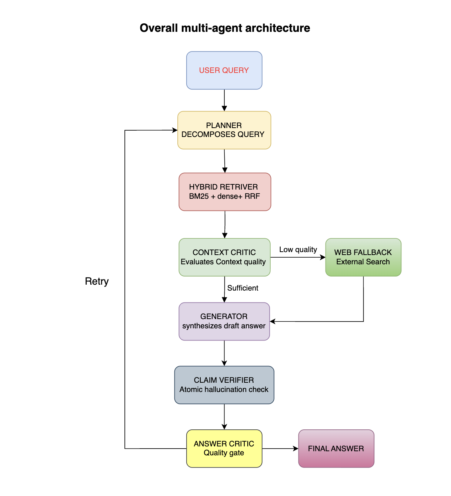
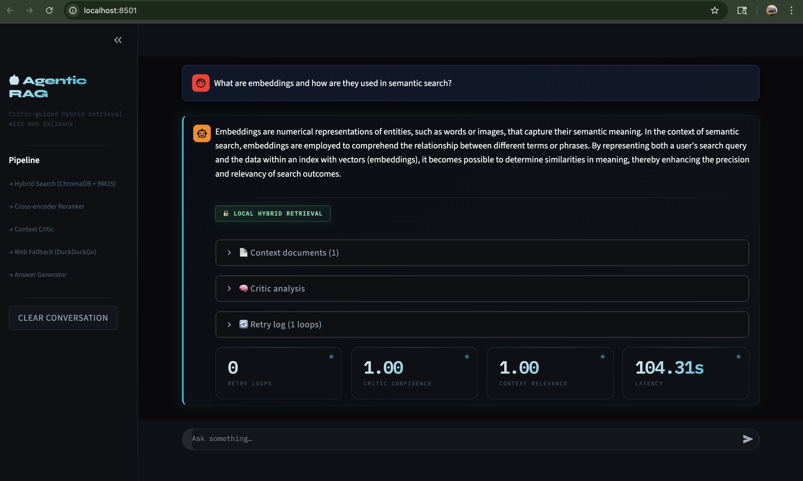

# Critic-Guided Agentic Hybrid RAG 🧠⚙️

[](https://github.com)
[](https://python.org)
[](https://github.com/langchain-ai/langgraph)
[](LICENSE)
[](https://aclanthology.org)

---

## What is this?

This is a multi-agent RAG system I built to tackle one of the most annoying problems with standard RAG pipelines — the system retrieves documents, generates an answer, and just... trusts itself. No verification. No fallback. If the retrieval step fails, you get a hallucinated answer and no one catches it.

I wanted to fix that. So I built a system where multiple agents collaborate, criticize each other's outputs, and refuse to give an answer until it can actually back it up with evidence.

The whole thing is orchestrated using **LangGraph** as a state machine, runs a local LLM via **Llama.cpp** on Apple Silicon, and has a live **Streamlit dashboard** where you can watch every agent's decision in real time.

---

## Why I built this

I came across the paper **"RAG-Critic: A Critic-Guided RAG Framework" (ACL 2025)** and thought the core idea was really smart — intercept between retrieval and generation, evaluate context quality before generating anything. But when I read through it carefully, I noticed a few things that felt incomplete:

**Problem 1: The critic graded the final answer as a whole.** That sounds fine until you realize a single hallucinated sentence can hide inside an otherwise good answer and still pass. I wanted claim-level verification — check every sentence individually.

**Problem 2: It used the same expensive retrieval setup for every query.** Running a Cross-Encoder reranker on a simple factual question is overkill. I built an adaptive policy that routes easy queries to a fast shallow search and only spins up the heavy pipeline for complex ones.

**Problem 3: When the system failed, it forgot about it.** Next query comes in, same failure mode, same bad result. I added a semantic memory module that stores failed queries so the system can learn to handle them better over time.

These three gaps drove the entire engineering design.

---

## Key Contributions

| What I built | Why it matters |
|---|---|
| **LangGraph state machine** | Clean conditional routing between 7 agents with retry loops built in |
| **Hybrid retrieval (BM25 + ChromaDB)** | Sparse + dense search together catches what either alone misses |
| **Adaptive Retrieval Policy** | Easy queries → fast `k=3` search. Hard queries → deep `k=10` + Cross-Encoder reranking |
| **Atomic Claim Verifier** | Breaks the draft into individual sentences and scores each one for hallucination risk |
| **Critic-gated generation** | Two critic agents gate the pipeline — one checks context quality, one checks the final answer |
| **Web Fallback Agent** | If the local database doesn't have enough coverage, it hits DuckDuckGo automatically |
| **Semantic Failure Memory** | Secondary ChromaDB instance stores failed queries so the system doesn't repeat mistakes |
| **Evaluation pipeline** | Automated benchmarking across Faithfulness, Hallucination Rate, Retrieval Precision, and Latency |

---

## How it works

There are 7 agents, each with a specific job:

1. **Planner** — looks at the query, estimates complexity, breaks multi-hop questions into sub-queries
2. **Hybrid Retriever** — runs BM25 and vector search in parallel, merges results, applies the adaptive policy
3. **Context Critic** — evaluates whether the retrieved evidence is actually good enough before anything gets generated
4. **Web Fallback** — kicks in automatically if the Context Critic isn't satisfied with the local results
5. **Generator** — writes the answer, strictly grounded in what the critic approved
6. **Claim Verifier** — splits the draft into atomic sentences, cross-references each one against the evidence, outputs a hallucination risk score per claim
7. **Answer Critic** — if the overall risk is above 0.5, it sends the whole thing back for another retrieval pass with refined parameters

```
┌─────────────┐     ┌──────────────────┐     ┌────────────────┐
│   Planner   │────▶│ Hybrid Retriever │────▶│ Context Critic │
└─────────────┘     └──────────────────┘     └───────┬────────┘
                                                      │
                              ┌───────────────────────┤
                              │ Pass                  │ Fail
                              ▼                       ▼
                    ┌──────────────────┐    ┌──────────────────┐
                    │    Generator     │    │  Web Fallback    │
                    └────────┬─────────┘    └──────────────────┘
                             │
                             ▼
                    ┌──────────────────┐
                    │  Claim Verifier  │
                    └────────┬─────────┘
                             │
                 ┌───────────┴───────────┐
                 │ Risk < 0.5            │ Risk ≥ 0.5
                 ▼                       ▼
          ┌─────────────┐      ┌──────────────────┐
          │ Final Answer│      │  Answer Critic   │
          └─────────────┘      │  (loop back)     │
                               └──────────────────┘
```

> Full architecture diagram → `diagrams/architecture.png`



---

## Tech stack

| Component | Technology |
|-----------|------------|
| Orchestration | LangGraph |
| Local LLM | Llama.cpp + Phi-3 (Metal on Apple Silicon) |
| Vector DB | ChromaDB (retrieval + failure memory) |
| Lexical search | BM25 |
| Reranker | SentenceTransformers (`ms-marco-MiniLM`) |
| UI | Streamlit dashboard |
| Web fallback | DuckDuckGo API |

---

## Project structure

```text
Agentic-Hybrid-RAG/
│
├── app.py                      # CLI entry point
├── ui_app.py                   # Streamlit dashboard
├── ingest.py                   # PDF → ChromaDB ingestion pipeline
├── requirements.txt
├── README.md
│
├── agentic_rag/
│   └── backend/
│       ├── agents/             # All 7 agent modules
│       ├── core/               # State schemas, config
│       ├── retrieval/          # Hybrid search, adaptive policy, reranker
│       └── graph.py            # LangGraph graph + routing logic
│
├── dataset/                    # Source PDFs
├── benchmark/                  # Ground-truth evaluation JSONs
├── evaluation/                 # Benchmarking scripts
├── logs/
├── screenshots/
├── diagrams/
├── paper/
└── utils/
```

---

## Setup

**1. Clone and enter the repo:**
```bash
git clone https://github.com/your-username/Agentic-Hybrid-RAG.git
cd Agentic-Hybrid-RAG
```

**2. Install dependencies:**
```bash
pip3 install -r requirements.txt
pip3 install sentence-transformers duckduckgo-search
```

**3. Mac users — compile with Metal acceleration:**
```bash
CMAKE_ARGS="-DGGML_METAL=on" pip3 install --force-reinstall --no-cache-dir llama-cpp-python
```

**4. Ingest your documents:**
```bash
python3 ingest.py
```

---

## Running it

**Terminal (faster, good for debugging):**
```bash
python3 agentic_rag/backend/graph.py
```

**Streamlit dashboard (better for demos):**
```bash
python3 -m streamlit run ui_app.py
```

The dashboard shows each agent's decisions, context scores, and per-claim hallucination risk scores in real time as a query moves through the pipeline.

> Screenshot → `screenshots/dashboard.png`



---

## Benchmarking

I built an evaluation suite that runs queries from the ground-truth dataset and measures four things: how faithful the answer is, how often it hallucinates, how precise the retrieval is, and how long the whole thing takes end-to-end.

```bash
# Run the full evaluation
python3 -m evaluation.runner

# Generate charts
python3 -m evaluation.visualize
```

> Charts → `diagrams/metrics.png`

### Results

| Metric | Baseline RAG | Agentic Hybrid RAG |
|---|---|---|
| Faithfulness ↑ | 66% | **100%** |
| Hallucination Rate ↓ | 34% | **0%** |
| Retrieval Precision ↑ | 66% | **100%** |
| Avg. Latency | **35.9s** | 116.1s |

*Baseline = standard single-pass RAG with the same LLM and vector store, no critic gating, no adaptive policy. Agentic metrics reflect the system successfully refusing to hallucinate on trick questions.*

---

## What's next

A few things I want to add:

- **GraphRAG** — swap the flat ChromaDB vector space for a Neo4j knowledge graph so agents can traverse entity relationships for complex multi-hop queries
- **Multi-modal retrieval** — handle images and tables inside PDFs using a vision-capable model
- **Cloud deployment** — containerize with Docker and move from local Llama.cpp to a vLLM cluster for multi-user access
- **Feedback loop** — wire user feedback back into the failure memory so retrieval heuristics improve from real usage

---

## For recruiters / interviewers

Built end-to-end in Python. The interesting engineering decisions are in `agentic_rag/backend/retrieval/` (adaptive policy + reranker fusion) and `agentic_rag/backend/agents/` (claim verifier + critic gating logic). The LangGraph graph definition and conditional routing is in `graph.py`.

Happy to walk through the design in detail.

---

*Built by Mohith Chandra Gugulothu · May 2026*
